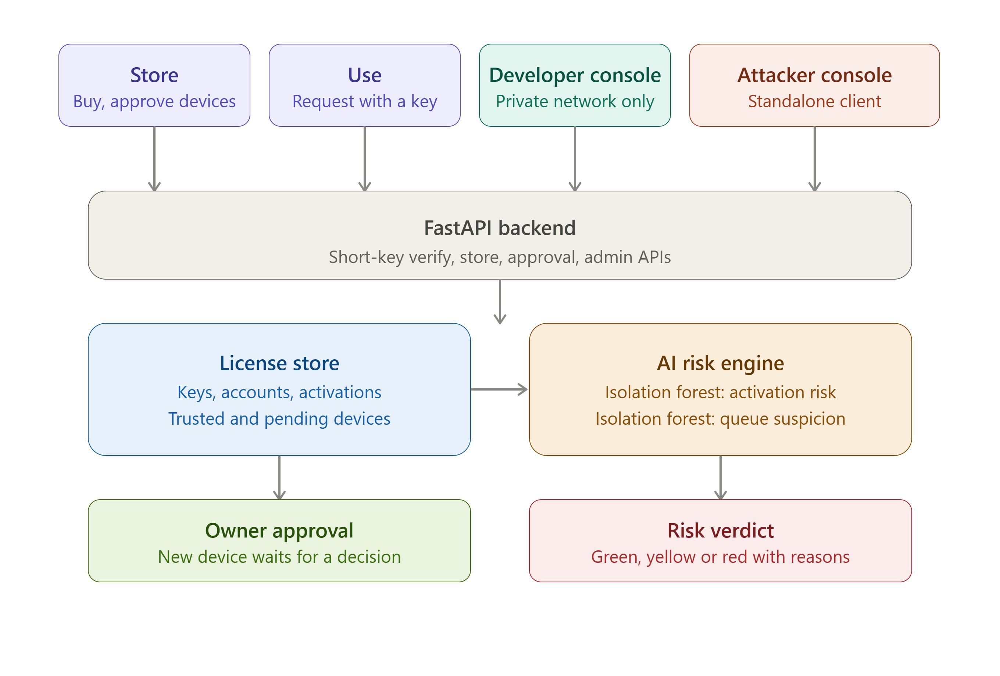
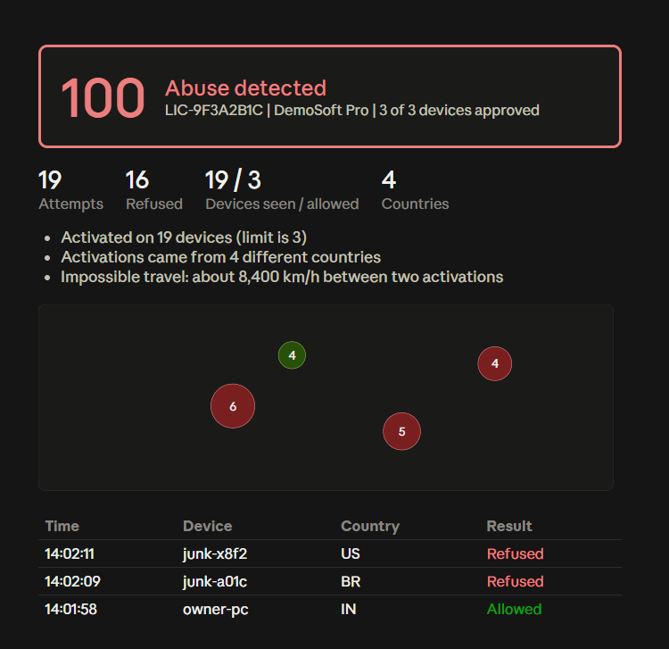

# License Guard

**OPCODE IMPACT 2026 | Hackathon Submission**

**Team Name:** Zypher
**Team ID:** OPC037

## 1. Problem Statement
Software piracy and license sharing cost vendors revenue and make it hard to tell a genuine customer from someone using a leaked or stolen key. Signature checks alone only catch forged keys, not a *valid* key that is being shared across many devices, countries or accounts. Vendors need a way to both verify a license cryptographically and notice when a technically legitimate credential is quietly being misused by someone it was never issued to.

## 2. Solution Title
AI-Powered Identity Intelligence for Detecting Misuse of Legitimate Digital Credentials

## 3. Solution Description
License Guard issues short, Microsoft-style product keys (`XXXXX-XXXXX-XXXXX-XXXXX-XXXXX`) that are cryptographically checked, not guessable, and tracked server-side. Every activation is scored in real time by a rule engine plus an Isolation Forest model that looks at device count, country spread, activation rate and "impossible travel" between countries, producing a green/yellow/red risk verdict with plain-language reasons — this is the core identity-intelligence layer, since it flags misuse of a *valid* credential rather than just rejecting invalid ones. New devices beyond the first must be approved by the license owner, and a second Isolation Forest model scores *pending approval requests themselves* so the owner can spot an automated flood of fake devices versus a genuine new phone or laptop. The system ships as four interfaces — a customer store, a shared-key request page, a developer/admin console, and a standalone attack simulator — so the detection logic can be demonstrated end to end, from a credential being issued to it being misused and caught.

## 4. Architecture Diagram


A FastAPI backend holds all license state in memory and exposes four front ends against it. The **store** (`/store`) lets a customer sign up, buy a plan, and receive a key; it also shows pending device requests with their AI suspicion scores so the owner can approve or deny them. The **shared-key page** (`/use`) is where anyone holding a key that isn't theirs — a teammate, a friend, or an attacker — submits a device name and country to request access; the response explains in plain language whether they're in, waiting for approval, or blocked, and why. The **developer console** (`/`) is restricted to the private network (direct LAN or `localhost`; requests arriving through a public tunnel are blocked by header and address checks) and shows every issued license, its live risk score, activation map and history, with issue/revoke controls. The **attacker console** (`/attacker` or a standalone copied HTML file) is a separate client that only ever calls the public `/api/verify` endpoint — exactly what a pirated copy of the product would do — and can simulate key sharing, impossible travel, key tampering, key forging, device impersonation, and approval-queue flooding. All four talk to the same backend, so an attack run on one screen is visible as a risk-score and device-approval change on the others in real time.

## 5. Technology Stack
- **Frontend:** Vanilla HTML, CSS and JavaScript (four standalone pages: store, shared-key request page, developer console, attacker console), no build step or framework
- **Backend:** Python, FastAPI, Uvicorn
- **Database:** In-memory Python dictionaries (demo-scope; no persistent database)
- **Other Technologies:** `cryptography` (Ed25519 signing for the underlying key material), `scikit-learn` (Isolation Forest, used twice: once for activation-pattern risk, once for approval-queue suspicion scoring), `numpy`, HMAC-SHA256 (short-key check codes), Cloudflare Tunnel (`cloudflared`) for exposing the store/attacker pages publicly during a demo while keeping the admin console private-network-only

## 6. Quick Start Guide
**Prerequisites:** Python 3.11+ and pip

**Installation & Execution:**
```bash
# From the project folder
pip install -r requirements.txt

# Start the server (use --host 0.0.0.0 to allow other devices on the network to connect)
python -m uvicorn app:app --host 0.0.0.0 --port 8000

# Open in a browser:
#   Customer store:       http://localhost:8000/store
#   Use a shared key:     http://localhost:8000/use
#   Developer console:    http://localhost:8000       (private network only)
#   Attacker simulator:   http://localhost:8000/attacker
#                          (or open attacker.html directly on a second device and
#                          point it at the server's address)

# Optional: expose the store/attacker pages to another network for a live demo
cloudflared tunnel --url http://localhost:8000
```

## 7. Output Screenshots


The developer console mid-attack: the risk score climbs from green to red as simulated activations arrive, the activation map plots where each attempt came from, and the reasons list explains exactly which signals fired (device count exceeded, impossible travel detected, repeated refusals).

## 8. Future Scope
- Persist licenses, accounts and activation history to a real database so state survives a restart
- Add admin authentication to the developer console instead of relying solely on network-location restriction
- Rate-limit the approval queue per source address to fully close the queue-flooding gap identified during testing
- Real payment integration for the store checkout flow
- Move the two Isolation Forest models to periodic retraining on real activation data instead of synthetic baselines

## 9. Team Contributions
| Member Name | Contribution |
|-------------|--------------|
| Abhinav Prasad | Server Module |
| Yadhavkrishna K S | Client Module, Frontend |
| Muhammed Nazim M K | Backend |
| Rohith P Menon | Attacker Module |

## 10. Tools Used
| Tool / Platform | Purpose / Why Used |
|-----------------|--------------------|
| FastAPI | Backend API serving the store, developer console and verification endpoints |
| scikit-learn (Isolation Forest) | Anomaly detection for both activation-pattern risk and approval-queue suspicion scoring |
| cryptography (Ed25519) / HMAC-SHA256 | Underlying key signing and the check-code scheme behind the short product keys |
| Claude (Anthropic) | Used throughout development to design the risk-scoring logic, build and iteratively harden the owner-approval flow, debug a device-impersonation vulnerability, and generate the three front-end consoles |
| Cloudflare Tunnel | Exposed the store and attacker pages for cross-network demo access while keeping the admin console private |
